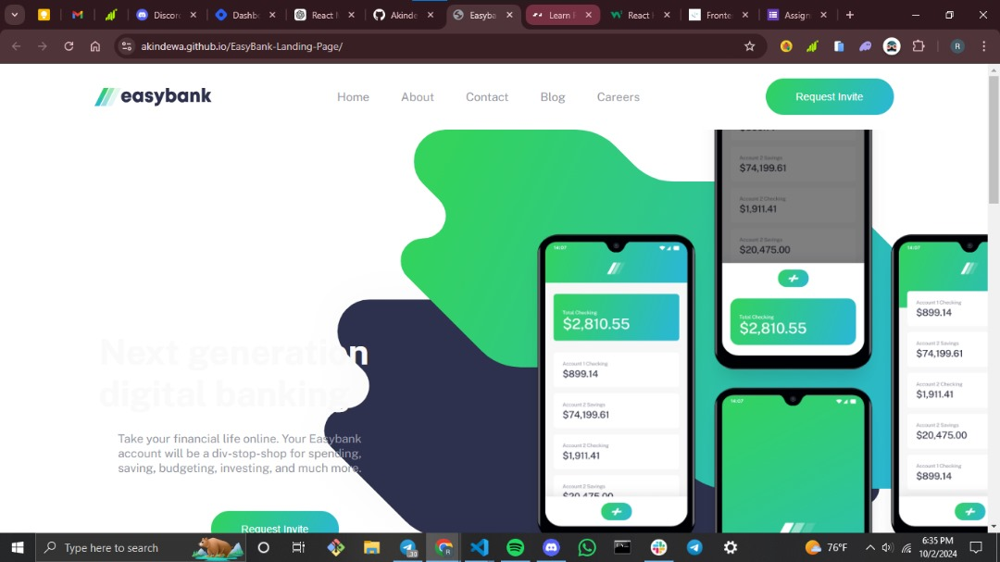
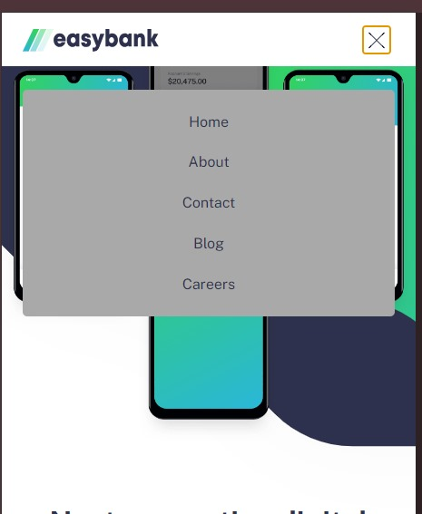

#  EASY_BANK_LANDING_PAGE

## Table Of Contents

## Overwiew

Users will be able to :

- View the optimal layout for the interface depending on their device's screen size
-  See hover and focus states for all interactive elements on the page

### Screenshot (desktop and mobile view)

  

  

  
### Links

  ![Code_Link] (https://github.com/Akindewa/EasyBank-Landing-Page.git)
  
  ![Live_Link] (https://akindewa.github.io/EasyBank-Landing-Page/)

### Built with

  - Javascript
  - HTML
  - CSS

## Article

#### Here's a link to the short article I wrote about this project
  ![Article_Link] (https://hashnode.com/edit/cm1inulm4000108l424mv3mzc)